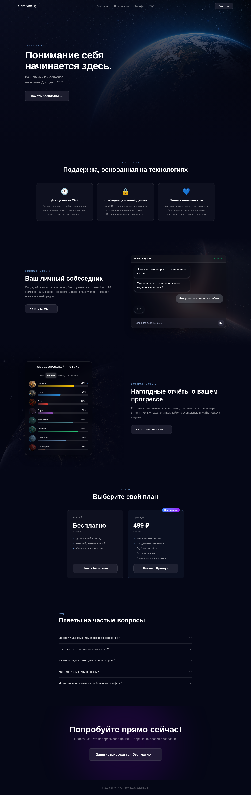

ЭФБО-10-23 Ефремов А.И. Лазарев Г.С. Никитин А.В.

# Практическая работа 3

## Тема

Хостинг продающего сайта (лендинга) стартапа Serenity AI.

## Ссылка на опубликованный лендинг

[https://gdj4.ru:8080/ui/](https://gdj4.ru:8080/ui/)

## Структура лендинга

1. **Шапка и навигация.** Содержит словесный логотип Serenity, разделы "О сервисе", "Возможности", "Тарифы", FAQ и кнопку "Войти".
2. **Первый экран.** Слоган, краткое описание и CTA-кнопка "Начать бесплатно".
3. **Преимущества сервиса.** Три карточки: доступность 24/7, конфиденциальный диалог и полная анонимность.
4. **Демонстрация чата.** Блок "Ваш личный собеседник" с имитацией диалога (ui элемент сервиса, но заглушка) и кнопкой "Начать диалог".
5. **Демонстрация статистики.** Блок "Наглядные отчёты о вашем прогрессе" с диаграммой эмоционального профиля (ui элемент сервиса, но заглушка).
6. **Тарифы.** Карточки "Базовый" и "Премиум" со стоимостью, набором возможностей и кнопками выбора.
7. **FAQ.** Раскрывающийся список ответов на вопросы.
8. **Финальный CTA и футер.** Повторный призыв "Попробуйте прямо сейчас!" с кнопкой "Зарегистрироваться бесплатно".

## Предпросмотр лендинга

Полноразмерный снимок опубликованной страницы сделан 16.09.2026 в десктопном разрешении 1440 px по ширине.

